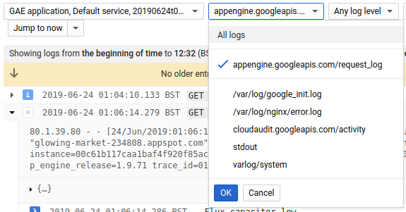
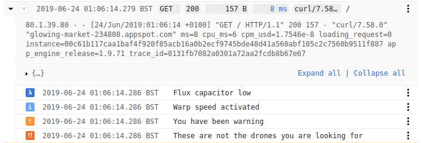
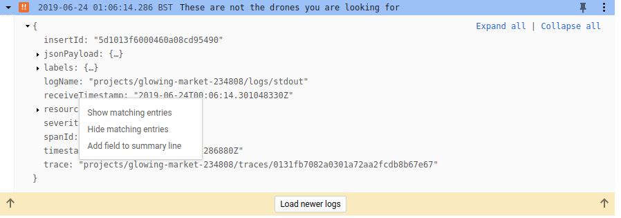
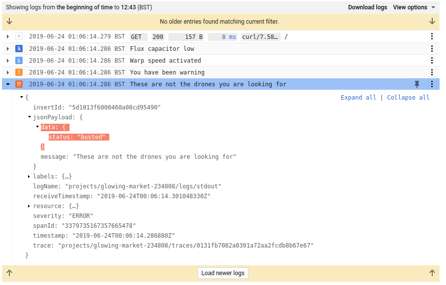

# Stackdriver GAE Logrus Plugin

[Logrus is a structured logger for Go](https://github.com/sirupsen/logrus) compatible with the standard library logger.

Stackdriver GAE Logrus Plugin is a lightweight plugin providing threaded message entries on Google Cloud Run and Google App Engine (GAE) Standard Environment.

Cloud Run and GAE adds a request header `X-Cloud-Trace-Context` to HTTP requests. `middleware.XCloudTraceContext` provides an HTTP Middleware component that parses this header and make it available in the context.


``` go
contextLogger := log.WithContext(r.Context())

contextLogger.WithFields(log.Fields{
	"battery": "50",
}).Debug("Flux capacitor low")

contextLogger.WithFields(log.Fields{
	"status": "busted",
}).Info("Warp speed activated")

contextLogger.WithFields(log.Fields{
	"status": "hmmm",
}).Warn("You have been warning")

contextLogger.WithFields(log.Fields{
	"status": "busted",
}).Error("These are not the drones you are looking for")
```

In the Stack Driver Logging Cloud Console you can filter results by request.



Opening an individual request will show each log entry nested within. Each entry will have a color coded icon showing its severity corrsponding to its nearest equivilent Logrus level.




Whilst debugging select any individual log message's `trace` value and click "Show matching entries".




This will automatically set the filters to reveal all log entries associated to that HTTP request.


Clicking the discover icon expands the log entry to reveal the `jsonPayload` section. `jsonPayload.data` contains the field data set using the standard Logrus `WithFields` method.

``` go
contextLogger.WithFields(log.Fields{
	"status": "busted",
}).Error("These are not the drones you are looking for")
```




To run the example locally use:
``` bash
make run
```

## Windows

If you do not have Make installed.

``` bash
go run ./examples/http-service/main.go
```

## Limitations
The `X-Cloud-Trace-Context` header is used to correlate log entries with a request. There are two versions of this header v1 and v2. v1 uses a Span ID comprised of a variable number of decimal digits (random unsigned 64-bit integer). v2 contains a span ID comprised of a 16 character hexadecimal string. The trace ID is 32 characters in both versions.

There will be times when a v1 decimal is exactly 16 characters long and could be mistaken for a v2 hexadecimal. There doesn't appear to be a deterministic way to differentiate between the two (all other headers a common to both v1 and v2), so the formatter will use heuristics to determine the version. The odds of an ambiguous span ID is very low, about 1 in 4,098 trace entries.

Many thanks to [csilvers](https://github.com/csilvers) for the [pull request that fixed this](https://github.com/andyfusniak/stackdriver-gae-logrus-plugin/pull/2).

### Probability of Ambiguous Span ID

For a span ID to be ambiguous, it needs to:

- Be a v1 ID that is 16 digits long (≈ 0.488 or 48.8%) and ...
- Look like a v2 ID but contain only digits 0-9 ((10/16)¹⁶ ≈ 0.0005 or 0.05%)


The combined probability is these two independent events multiplying:
0.488 × 0.0005 = 0.000244 or about 0.0244%.

This means only about 1 in 4,098 trace entries would be truly ambiguous (having both a 16-digit v1 ID and containing only digits 0-9).

This is just a theoretical estimate, because it assumes that the span ID is truly random. I have no idea what Google uses to generate these IDs, so the actual probability could be higher or lower.
